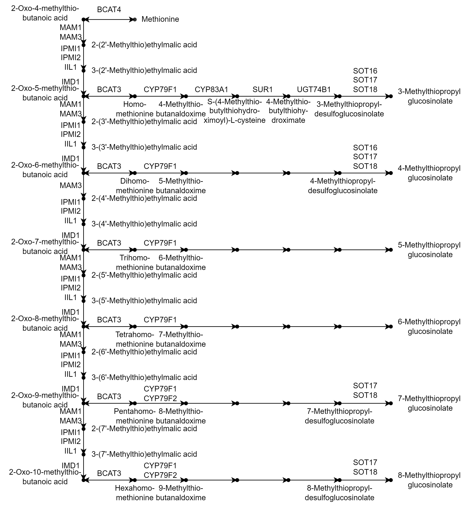
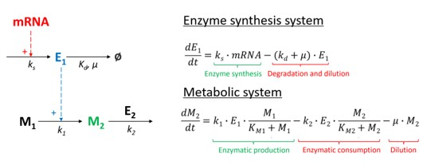

This is an ordinary differential equation (ODE) model for the aliphatic Glucosinolates (GSL) pathway. The following is the pathway.

We quantified the processes of the enzyme synthesis system and metabolic system by the following differential equations

The "mRNA" parameter was represented by Transcripts Per Million (TPM) that was generated by RNA-seq data. Other parameters were gained from various databases and literature. All of the parameters can be found in this repository.

By this model, we can predict the glucosinolate content in Arabidopsis seedlings under different conditions, which could help to understand the complex GSL pathways and guide the metabolic engineering of GSL.

